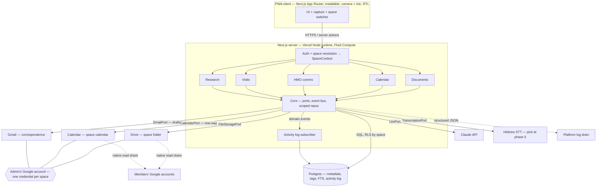

# HealthApp — Architecture & Design

Personal health management app for navigating the Israeli healthcare system: document management, HMO (קופת חולים) communications, appointments, visit support, and medical research assistance. Built for shared use — a health record is usually managed by more than one person.

## 1. Design goals

1. **Decoupled modules** — each feature is independently buildable, testable, and shippable. You can build module 1 and use the app for months before module 5 exists.
2. **Swappable integrations** — Google Drive is the file store *today*, behind an interface. Same for calendar, email, OCR, transcription, and LLM providers.
3. **Metadata in the app, blobs in storage** — the app's database is the source of truth for document metadata, tags, and links. Drive only holds the files. This is what makes storage swappable: migrating means copying blobs and updating one column.
4. **Shared by design** — the tenancy boundary is a *space*, not a user. A patient, their spouse, and an adult child can all work in one space. Every domain row is space-scoped from day one, because retrofitting tenancy is a rewrite.
5. **Accountable** — in a shared space, "who did this?" must always be answerable. Every state change is recorded in an append-only activity log.
6. **Hebrew-first UI** — RTL layout, Hebrew document understanding (OCR + extraction must handle Hebrew medical documents).

## 2. Architecture style: modular monolith with ports & adapters

A single deployable app (no microservices — wrong tradeoff for a personal app), organized as feature modules that communicate only through:

- **Shared domain types** (`Document`, `ActionItem`, `Event`, …)
- **Core service ports** (interfaces)
- **A lightweight in-process event bus** (e.g. `document.scanned`, `action.required`) so modules react to each other without importing each other

```
┌─────────────────────────────────────────────────────────────┐
│                      UI (Next.js, RTL)                       │
├─────────────────────────────────────────────────────────────┤
│   Request pipeline: authenticate → resolve space → SpaceCtx  │
├──────────┬──────────┬──────────┬──────────┬─────────────────┤
│ Documents│ Calendar │ HMO Comms│  Visit   │ Research &       │
│  module  │  module  │  module  │ Companion│ Education module │
├──────────┴──────────┴──────────┴──────────┴─────────────────┤
│    Core: domain types · event bus · space-scoped repos · DI  │
├─────────────────────────────────────────────────────────────┤
│ Ports:  FileStorage │ Calendar │ Email │ OCR/Extract │      │
│         Transcribe  │ LLM      │ Search                     │
├─────────────────────────────────────────────────────────────┤
│ Adapters: GoogleDrive │ GoogleCalendar │ Gmail │ Claude API │
│           (each replaceable without touching modules)        │
└─────────────────────────────────────────────────────────────┘
```

**Dependency rule:** feature modules depend on ports and domain types only — never on adapters and never on each other. Adapters are wired to ports in a single composition root (`lib/container.ts`).

**Context rule:** no module function is callable without a `SpaceContext`. Modules never receive a raw database handle — only repositories already bound to a space (see §3.5).

### Suggested repo layout

```
src/
  core/
    domain/          # shared types: Document, Tag, ActionItem, Event, Contact, Space, Member...
    ports/           # interfaces: file-storage.ts, calendar.ts, email.ts, ocr.ts, llm.ts, transcription.ts
    events/          # typed event bus + subscribers (activity-log subscriber lives here)
    context/         # SpaceContext, request pipeline, authorization helpers
    db/              # repository factory — the only module that builds SQL
    logging/         # structured logger, redaction, request correlation
    container.ts     # composition root — the ONLY place adapters are instantiated
  adapters/
    google-drive/    # implements FileStoragePort
    google-calendar/ # implements CalendarPort
    gmail/           # implements EmailPort
    claude/          # implements LlmPort + ExtractionPort
    transcription/   # implements TranscriptionPort
  modules/
    identity/        # users, spaces, membership, invitations
    documents/       # scan, extract, tag, search, upload
    calendar/        # events, reminders, action items
    hmo-comms/       # prescription conversion, hitchayvut requests, correspondence tracking
    visit-companion/ # recording, transcription, summary, questions list
    research/        # rights, specialists, costs, procedure explanations
    activity/        # activity feed queries (write path is the event subscriber)
  app/               # Next.js App Router pages — thin, call into modules
```

## 3. Identity, spaces & sharing

### 3.1 The space is the tenancy boundary

A **space** represents one person's health world — their documents, appointments, correspondence, and questions. **Members** are the people who manage it: the patient themselves, a spouse, an adult child caring for a parent.

This distinction matters. The space has a `subject_name` (whose health this is) that is independent of its members, because the most common real scenario — an adult child managing a parent's care — has the subject as someone who may never log in.

A user can belong to several spaces (their own, their mother's) and switches between them; the active space is part of every request.

### 3.2 Roles

| Role | Can |
|---|---|
| `owner` — the **admin** | Everything, plus: manage members, connect the Google account that backs the entire space, delete the space. Exactly one per space (transferable, with the caveats in §3.4). |
| `editor` | Create/edit documents, events, questions; draft and send correspondence; record visits. |
| `viewer` | Read everything. Useful for a sibling who wants visibility without responsibility. |

Permission checks live in one place (`core/context/authorization.ts`) as `can(ctx, 'document.delete')` — never scattered as inline role comparisons.

### 3.3 Invitation flow

1. Owner invites by email address, choosing a role.
2. A row is written to `space_invites` with a single-use, expiring token (7 days), bound to that email.
3. Invitee receives a link; on accepting they sign in with Google. **The signed-in email must match the invited email** — otherwise a leaked link grants access to a stranger's medical records.
4. Acceptance creates a `space_members` row and logs `member.joined`.
5. The app immediately grants the new member native Google access — Drive folder permission and calendar ACL entry — using the admin's credential (§3.4), and stores the resulting permission IDs on the membership row.

Revoking a membership deletes the row *and* removes both Google grants. See §3.4 for why that second half is security-critical.

### 3.4 The admin account model

**One Google account backs the whole space: the admin's.** The space owner (the admin) connects their Google account once, and every Google resource the space uses lives there:

| Resource | Lives in | Shape |
|---|---|---|
| Drive | Admin's Drive | A single `HealthApp/<subject>/` folder tree holding all the space's documents |
| Calendar | Admin's Calendar | A dedicated **secondary calendar** per space (e.g. "HealthApp — אמא"), not the admin's personal calendar |
| Gmail | Admin's mailbox | All kupah correspondence sends and receives here |

Members get at the Drive folder and the calendar through **native Google sharing** — the folder is shared with their Google account, the calendar has an ACL entry for them. So the files show up in their Google Drive app and the appointments appear in their own Google Calendar, without the app being in the middle.

**The app performs the sharing automatically.** You described this as the admin having to share manually; the app can do it for them at the moment an invitation is accepted, using the admin credential it already holds — Drive `permissions.create` on the folder and Calendar `acl.insert` on the space calendar. Same permission model, no manual step, and no chance of a member being invited but never actually granted access. Manual sharing still works as a fallback if a grant fails.

If the admin's token is expired or revoked when a member joins, the grant is recorded as `pending` and surfaced as a task on the admin's dashboard rather than failing the invitation.

**Native access is read-only for everyone, regardless of app role.** Editors get `writer` inside the app but only `reader` on the Drive folder and the calendar. This is deliberate: if a member could add or delete files directly in Drive, the database — which is the source of truth for metadata, tags, and search (goal 3) — would silently drift out of sync with the folder. All writes flow through the app, which uses the admin credential. Native sharing is for convenient reading on a phone, not a second write path.

App role maps to the Google grant as: `editor` → Drive `reader` + Calendar `reader` (writes via app); `viewer` → the same. The difference between the two roles is enforced entirely in the app.

**What this buys:**
- The app stores **exactly one Google credential per space**, not one per member. Far less token management, refresh handling, and attack surface.
- Members need no Google API scopes at all — they sign in for identity only. The app never asks a member for Drive or Calendar permission.
- The per-member calendar sync table disappears; one shared calendar serves everyone, and each member can toggle its visibility in their own Google Calendar UI.

**What it costs — accept these knowingly:**
- *The admin is a single point of failure.* If they revoke the app's access or delete their account, the space loses files, calendar, and correspondence at once. Surface connection health prominently and alert on token failure.
- *Admin transfer is genuinely awkward.* The new admin connects their account, but the existing files still sit in the old admin's Drive. Consumer Drive supports ownership transfer per item (`permissions.update` with `transferOwnership`), and it requires the recipient to accept. Treat transfer as a deliberate, potentially slow migration flow — not a button that returns instantly. Document it as a known limitation for v1 rather than pretending otherwise.
- *Correspondence appears to come from the admin* even when another member drafted it. The app records the real drafter in `sent_by_user_id` and the activity log, and displays the Gmail thread in-app to all members, so everyone sees replies without needing mailbox access. If you'd rather each member sent from their own Gmail, that's a one-line change in the table above — but then replies scatter across mailboxes and the correspondence tracker can only follow the ones it has credentials for.

**Reconciliation.** The app is the source of truth for *intent*; Google enforces native access. They can drift if someone edits sharing directly in Drive. Re-assert grants on every role change and membership change, and run a periodic reconcile that compares `space_members` against the folder's actual permission list, reporting differences to the admin.

**Revocation is security-critical.** Removing a member must delete both the Drive permission and the calendar ACL rule, which is why their IDs are stored on the membership row rather than looked up by email at removal time. If either deletion fails, the removal is marked incomplete, retried, and raised to the admin — an ex-member silently retaining native Drive access to medical records is the worst failure this system can have.

As built, that ordering is: mark `removal_requested_at` (which is what `app_spaces_for_user` filters on, so app access ends at once) → revoke both grants → delete the row, and only if nothing was left behind. The row deliberately outlives a failed revocation, because deleting it would discard the permission ids the retry needs and leave the surviving grant with nothing in the database that remembers it. `npm run verify:sharing` exercises this branch specifically.

### 3.5 Enforcement — defense in depth

A single missing `WHERE space_id = …` leaks one family's medical records to another. Two independent layers:

**Layer 1 — structurally scoped repositories.** Repositories are built per-request from the context, and inject the predicate themselves:

```ts
export interface SpaceContext {
  spaceId: string;
  userId: string;
  role: 'owner' | 'editor' | 'viewer';
  requestId: string;   // correlates logs and activity entries
}

const repos = createRepositories(db, ctx);   // every query is space-bound by construction
await repos.documents.findByTag('MRI');      // no space_id parameter exists to forget
```

Modules import repositories, never the raw `db` client. Enforce with an ESLint `no-restricted-imports` rule on `core/db/client`.

**Layer 2 — Postgres row-level security as a backstop.** Each request sets `SET LOCAL app.current_space_id` inside the transaction; every space-scoped table carries a policy `USING (space_id = current_setting('app.current_space_id')::uuid)`. If layer 1 is ever bypassed, the database returns nothing rather than someone else's records.

**Testing rule:** every module gets a "cross-space isolation" test — seed two spaces, act as a member of one, assert zero visibility into the other. Non-negotiable for health data.

### 3.6 Concurrency

Two members can edit the same document metadata. Use optimistic locking: every mutable row carries a `version` integer, updates assert the expected version, and a conflict returns a "someone else changed this" prompt rather than silently overwriting. Realtime presence/notifications are out of scope for v1 — plain fresh reads are fine at family scale.

## 4. The storage abstraction (Drive today, swappable later)

```ts
// core/ports/file-storage.ts
export interface FileStoragePort {
  upload(ctx: SpaceContext, file: FileBlob, opts: { folder?: string; name: string; mimeType: string }): Promise<StoredFile>;
  download(ctx: SpaceContext, fileRef: string): Promise<FileBlob>;
  delete(ctx: SpaceContext, fileRef: string): Promise<void>;
  getShareableLink(ctx: SpaceContext, fileRef: string): Promise<string>;
  ensureFolder(ctx: SpaceContext, path: string): Promise<string>;   // e.g. "HealthApp/2026/Imaging"
}

export interface StoredFile {
  ref: string;        // opaque provider ID (Drive fileId) — stored in DB, never parsed
  provider: 'google-drive' | 's3' | 'vercel-blob' | 'local';
  webUrl?: string;
}
```

Every method takes the space context, because the adapter must resolve *which* credential to use — that's exactly the lookup the Drive adapter performs (space → admin's stored refresh token).

Rules that keep the swap possible:
- Modules only ever see `StoredFile.ref` as an opaque string.
- Folder structure is expressed logically (`ensureFolder(ctx, "HealthApp/2026")`); the adapter maps it to provider concepts.
- The `provider` field is stored per-file, so migration can be gradual (old files on Drive, new files elsewhere) with a `CompositeStorageAdapter` routing by provider.
- Search never touches the storage provider — it runs on DB metadata, tags, and extracted text.

### Native sharing as an optional capability

Granting a member native Google access (§3.4) is a Drive feature, not a universal storage feature — S3 has no notion of "share this with a Gmail address." Keeping it out of the core port preserves swappability:

```ts
// core/ports/native-sharing.ts
export interface NativeSharingCapable {
  grantAccess(ctx: SpaceContext, principalEmail: string, level: 'reader' | 'writer'): Promise<string>; // permission id
  revokeAccess(ctx: SpaceContext, permissionId: string): Promise<void>;
}

export const isNativeSharingCapable = (a: unknown): a is NativeSharingCapable =>
  typeof (a as NativeSharingCapable)?.grantAccess === 'function';
```

The Google Drive and Google Calendar adapters implement it; the identity module feature-detects before granting. An adapter that doesn't implement it simply means members read files through the app only — a degraded convenience, not a broken feature.

A future move to app-owned object storage (S3, Vercel Blob) *simplifies* the tenancy story, since it removes the admin-credential single point of failure in §3.4 entirely — at the cost of the data no longer living in a real person's Google account. The port makes that a later decision rather than a now one.

## 5. Feature modules mapped to your requirements

### M0 — Identity & spaces
Google sign-in, space creation, membership, invitations, space switcher. Owns nothing medical; everything else depends on it.

### M1 — Documents (סריקה, תיוג, חיפוש)
The foundation; everything else links to it.
- **Intake:** camera capture (mobile PWA) or file upload → OCR (Hebrew + English). A document may be **several pages**: they are staged and reordered before reading, sent to the model in one call so fields can be drawn from across the whole document, and stored as a single merged PDF. One page is stored unchanged. This is why `documents.storage_ref` stays singular — the merge happens before upload, so the "one opaque ref per document" rule in §4 survives multi-page intake without a child table.
- **AI extraction** (LLM port): suggested name, date, hospital, doctor, document type, tags, and **"action required?"** — always shown to the user for confirmation before saving (extraction is a suggestion, not truth).
- **Persist:** blob → `FileStoragePort` (space's Drive), metadata + extracted text → DB, scoped to the space.
- **Search:** by tags, free text over extracted content, date, doctor, hospital, type.
- **Deletion is soft** (`deleted_at`) — medical records shouldn't vanish on a misclick, and in a shared space one member shouldn't be able to destroy another's work irreversibly.
- **Emits events:** `document.created`, `document.action-required` — the calendar module listens; the documents module doesn't know the calendar exists.

### M2 — Calendar & action items (לוח שנה, תזכורות)
- Internal events/tasks table (source of truth) + one-way sync out to the space's dedicated Google calendar, which lives in the admin's account and is shared read-only with every member (§3.4). One calendar, one sync path — members see appointments in their own Google Calendar and toggle visibility there.
- Listens for `document.action-required` → proposes a reminder/event ("להזמין תור מעקב עד 15.9").
- Appointment entity links to: doctor/clinic contact, related documents, questions list (M4).

### M3 — HMO communications (תקשורת מול קופ"ח)
- **Request flows as typed templates:** prescription conversion (מרשם רופא → מרשם קופה), hitchayvut / טופס 17 requests, general inquiries. Each flow = template + required attachments (picked from M1) + recipient.
- Sends via `EmailPort` from the space's mailbox — the admin's Gmail (§3.4) — **always drafted for user review before sending**.
- **Correspondence tracker:** each request has a status (draft → sent → awaiting reply → done) and records which member actually drafted and sent it, with follow-up reminders via the event bus → M2.

**As built, the draft lives in the app rather than in Gmail, and replies are not read.** This is a scope decision, not a simplification. Every Gmail scope that can hold a draft or read a thread — `gmail.compose`, `.readonly`, `.modify`, `.metadata` — is classified **restricted** by Google: it grants the app read access to the admin's entire personal mailbox and requires an annual third-party security assessment (CASA) to publish. `gmail.send` is merely *sensitive* and can only send. Choosing it keeps §11's minimal-scope claim true — **the app cannot read the admin's mail** — at the cost of reply detection.

The review step survives intact, and arguably improves: a request is composed from a template, stored as a `correspondence` row, edited freely, and shown in full on its own screen before anything leaves. There is no path to `send()` that does not pass through a row a person looked at.

What is lost is the app noticing a reply. `awaiting_reply → done` is a person reporting it, and the follow-up proposal that M2 raises ten days after sending is the only thing standing between a request and being forgotten. Revisit if the tracker proves too manual — the decision is recorded in §12, and `correspondence.thread_ref` is stored precisely so that a later phase has an anchor.

### M4 — Visit companion (הקלטה, שאלות לרופא)
- **Questions list:** questions accumulate per doctor/appointment — and in a shared space, any member can add one, so the person actually attending walks in with the whole family's questions. A reminder fires at appointment time (via M2) showing the list.
- **Recording:** record on phone → `TranscriptionPort` (Hebrew speech-to-text) → LLM summary (key points, instructions, follow-ups) → saved as a document in M1 — searchable like everything else, and visible to members who couldn't attend.

**As built, Phase 5 records and stores audio but does not transcribe it.** §12 wants Hebrew speech-to-text compared on real clinic audio before it is trusted, and there was no such audio until this module produced some. A visit also happens exactly once, so capture is the half that cannot wait while a provider is evaluated; a stored recording can be transcribed retroactively, and `visits.transcript_ref` / `summary_doc_id` are already there for when it is. `TranscriptionPort` is deliberately left unimplemented rather than stubbed — an adapter nobody has evaluated, wired into a health app, is worse than an honest gap.

**The "reminder at appointment time" is a link and a count, not a notification.** The app has no scheduler and no push channel — that was deferred in Phase 2 and is still deferred — so what M2 actually does is show, on each appointment in the agenda, how many questions are waiting on it, linking to the screen that lists them. That is as far as "fires a reminder" can honestly go until notifications exist.

**Recording consent (§12, decided).** The rule is that the person recording is a person in the room, and they are prompted to tell the doctor. Under Israeli law you may record a conversation you are party to, which is what keeps the app inside the line; the prompt covers the ethics the law does not. No app can verify presence, so the app does the one thing it can — it states the rule and records who pressed the button, in `visits.recorded_by_user_id`.

### M5 — Research & education (בירור זכויות, מומחים, עלויות, הסברים)
Chat/report-style assistant screens powered by the `LlmPort` + web search:
- Rights lookup (זכויות בקופה/ביטוח לאומי/ביטוחים משלימים) — grounded in official sources (kolzchut.org.il, HMO sites), with links.
- Specialist/clinic research; sharap and private treatment cost estimates.
- Procedure explainers: what it is, risks, success rates, alternatives — **always with sources and a clear "not medical advice, discuss with your doctor" framing**, and an option to turn open points into questions for M4.
- Results can be saved as documents into M1.

## 6. Data model

### Identity & tenancy
```
users           id, google_sub, email, name, created_at, last_seen_at
spaces          id, name, subject_name, admin_user_id, created_at,
                storage_provider, google_credential_ref, google_credential_status,
                drive_folder_id, google_calendar_id
space_members   id, space_id, user_id, role, joined_at,
                drive_permission_id, calendar_acl_id,
                share_status(pending|active|failed|not_applicable),
                removal_requested_at   -- set when a removal could not finish
                                                              [unique(space_id, user_id)]
space_invites   id, space_id, email, role, token_hash, expires_at,
                accepted_at, invited_by_user_id
```

### Domain tables — every one carries `space_id`
```
documents      id, space_id, name, doc_type, doc_date, hospital, doctor_id,
               storage_ref, storage_provider, extracted_text, action_required,
               created_by, version, created_at, updated_at, deleted_at
tags           id, space_id, name        /  document_tags: document_id, tag_id
contacts       id, space_id, kind(doctor|clinic|hmo), name, specialty, phone, email
events         id, space_id, kind(appointment|reminder|task), title, notes,
               starts_at, ends_at, all_day, location, status(scheduled|done|cancelled),
               source_document_id, created_by, version,
               external_calendar_ref,  -- id in the space's shared calendar, single ref
               calendar_sync_status(pending|synced|failed)
action_items   id, space_id, source(document|correspondence|visit), source_id,
               title, due_at, status(proposed|accepted|dismissed|done), event_id,
               created_by
correspondence id, space_id, flow_type, status, contact_id, recipient_email,
               subject, body, thread_ref, message_ref,
               sent_by_user_id, sent_at, created_by, version
                        /  correspondence_attachments: correspondence_id, document_id, space_id
questions      id, space_id, contact_id, event_id, text, asked, answer_summary,
               created_by
visits         id, space_id, event_id, recording_ref, recording_provider,
               recording_mime_type, recording_duration_ms, recording_bytes,
               transcript_ref, summary_doc_id, notes,
               recorded_by_user_id, recorded_at
                        -- transcript_ref and summary_doc_id are unpopulated by design
```

### Observability
```
activity_log   id, space_id, actor_user_id, actor_type(user|system|integration),
               action, entity_type, entity_id, summary, metadata jsonb,
               request_id, ip, user_agent, created_at
```

Indexes that matter: `(space_id, …)` leading on every domain index; `activity_log (space_id, created_at desc)` for the feed and `(entity_type, entity_id)` for per-document history.

Two notes on `events` as built, both deliberate departures from the sketch above:

- **`starts_at` / `ends_at` rather than `due_at`.** An appointment has a duration and a reminder does not; one pair of columns serves both, and it matches `CalendarEventInput` so the adapter needs no translation.
- **No `contact_id` yet.** Nothing populates a contacts table, so it would be an empty column pointing at an empty table. It arrives with M3 as a backfill from `documents.doctor`, exactly as the same decision was deferred for `documents`.

`correspondence.body` holds the composed request, which is health content about a named person. It lives in the database for the same reason `documents.extracted_text` does — the table is space-scoped and RLS-guarded, and a tracker that cannot show what was actually asked for is not a tracker. It must never reach an application log (§7.1) or an activity summary, and the summaries M3 writes name the *flow*, never the contents.

`action_items` and `events` are separate tables because the app's rule is that it never schedules anything on its own (§11). An extracted "book a follow-up" lands in `action_items` as `proposed`; a person choosing a time is the only thing that creates an `events` row. The status on an action item is therefore the record of a human decision, not a workflow stage.

## 7. Observability: application logs and activity log

These are two different systems and conflating them is a common mistake. One is for you, debugging at 2am; the other is for the users of a shared space, answering "who sent that to the kupah?"

| | Application logs | Activity log |
|---|---|---|
| Audience | Developer | Space members (and compliance) |
| Content | Technical events, timings, errors | Domain actions with actor and target |
| Store | Log platform (stdout → Vercel/Axiom) | Postgres `activity_log` table |
| Mutability | Ephemeral | Append-only, permanent |
| Health content | **Never** | References and short summaries only |
| Retention | 30–90 days | Life of the space |

### 7.1 Application logs

Structured JSON, one line per event, emitted through `core/logging` — never bare `console.log`.

```ts
log.info('document.extraction.completed', {
  requestId, spaceId, userId, module: 'documents',
  documentId, durationMs: 4210, model: 'claude-…', tokensIn: 1840, tokensOut: 310,
});
```

Every line carries `requestId`, `spaceId`, `userId`, `module`, and an `event` name; timed operations add `durationMs`; failures add `error.type` and a stack, never raw payloads. Levels: `debug` (local only), `info` (state changes, integration calls), `warn` (degraded — retry succeeded, extraction low-confidence), `error` (request failed).

**Redaction is a hard rule, not a guideline.** Application logs must never contain document images or extracted text, visit transcripts or summaries, email bodies, LLM prompts/completions, OAuth tokens, or `subject_name`. The logger takes an explicit allowlist of field names and drops everything else, so the default for a new field is *not logged*. For LLM calls, log the metadata (model, token counts, latency, cost, purpose) and never the content — that gives you cost and performance observability without putting a stranger's MRI report in a log aggregator.

Worth logging deliberately: every outbound integration call with provider, operation, latency, and outcome; every LLM call's metadata; every authorization denial (`authz.denied` — a spike means either a bug or someone probing); slow queries.

### 7.2 Activity log — who did what

**Written from the event bus, not from call sites.** The core already has one; every state-changing command emits a domain event, and a single `ActivityLogSubscriber` in `core/events` is the only writer to the table. This means you cannot forget to log an action — if it changed state, it emitted an event, and the subscriber persisted it. It also keeps the modules unaware that auditing exists.

Action names follow `entity.verb`:

```
space.created           member.invited        member.joined
member.role_changed     member.removed        storage.connected
document.created        document.updated      document.deleted
document.downloaded     tag.added
event.created           event.updated         event.calendar_synced
correspondence.drafted  correspondence.sent   correspondence.status_changed
question.added          visit.recorded        visit.transcribed
research.saved
```

Two details that make it useful rather than decorative:

- **`summary` is denormalized human-readable text** written at log time (`"העלתה מסמך: סיכום ביקור אורתופד"`). The entity may later be deleted or renamed; the history must stay readable regardless.
- **`metadata` holds a before/after diff** for updates, so "who changed this appointment's date?" is answerable, not just "someone touched it."

Append-only is enforced at the database, not by convention: the application's role gets `INSERT` and `SELECT` on `activity_log` and no `UPDATE`/`DELETE` grant.

`system` and `integration` actor types cover actions with no human behind them — a cron-fired reminder, an inbound email matched to a correspondence thread — so gaps in the timeline never look like data loss.

**Surface it in the UI.** A space activity feed ("דנה העלתה מסמך · לפני שעתיים") is genuinely useful in shared caregiving, not just an audit artifact — it's how a family member catches up on what happened while they weren't looking. Per-document history on the document page too.

`request_id` appears in both systems, so an activity entry can be traced to the full technical log of the request that produced it.

## 8. Suggested stack (defaults, all swappable)

| Concern | Choice | Why |
|---|---|---|
| App | Next.js (App Router) + TypeScript, PWA | One codebase, mobile camera + audio capture via PWA, RTL support |
| DB | Postgres (Neon or Supabase) | Relational metadata, `tsvector` full-text search, RLS for tenancy backstop, `pgvector` later |
| Files | Google Drive (per requirement) | Behind `FileStoragePort`, one admin credential per space |
| OCR + extraction | Claude API (vision) | Single call does OCR + structured extraction from Hebrew documents |
| Transcription | Pluggable port | Needs good Hebrew support — evaluate at M4 (hosted API first; self-hosted Hebrew Whisper in a sidecar if privacy demands it) |
| Calendar/Email | Google Calendar / Gmail APIs | Admin's account only: a dedicated space calendar plus the correspondence mailbox, shared natively with members |
| Auth | Google OAuth (Auth.js) | Admin consents to Drive/Calendar/Gmail scopes; every other member signs in for identity only |
| Logging | `pino` → stdout → platform log drain | Structured JSON, cheap, no vendor lock-in |

## 9. Build order (each phase ships something usable)

0. **Phase 0 — Foundation** *(done — see README for what is built)*: users, spaces, membership, `SpaceContext` plumbing, scoped repositories + RLS, structured logging, the activity-log subscriber, and the admin Google connection (consent, token storage, folder + calendar provisioning). The UI can show a single auto-created space where you are the admin, with no sharing screens at all — but the columns, scoping, and log writes exist from the first commit. *This is the part that is painful to add later; everything else is not.*
1. **Phase 1 — Documents core** *(done)*: upload/scan → AI extraction → confirm → Drive + DB → tag search. *(M1; app is already useful)*
2. **Phase 2 — Actions & calendar** *(done)*: action-required flag → reminders/events, one-way sync to the space's shared Google calendar. *(M2)*
3. **Phase 3 — Sharing** *(done)*: invitations, roles, member management, the named activity feed, the space switcher, and the Google grant/revoke automation (§3.4) with its reconciliation report. *(M0 completion)*

    Three things about it are worth carrying forward. **The app does not send the invitation** — it produces a single-use link and the owner sends it; a Gmail send scope is *restricted* (§12) and disproportionate for one message. **Removal marks before it deletes**: app access ends first, then the grants are revoked, and the row is destroyed only once nothing is left behind, so a failed revocation leaves visible, retryable work instead of an ex-member holding native access nothing remembers. **The calendar half needs its own consent** (§12), requested at the first invitation; until it exists, Drive sharing works and calendar shares sit at `pending`.
4. **Phase 4 — HMO comms** *(done)*: three Clalit request templates, attachments picked from M1, an in-app draft that is reviewed and sent, and the correspondence tracker. Contacts arrive here as the backfill §6 promised. *(M3)*

    The shape is set by one measured constraint (§12): the app holds **send-only** mail access, so drafts live in the app and replies are not read. Sending is the only irreversible, outward-facing act in the codebase, which is why it is claimed in the database before it is attempted — two members pressing send produce one message — and released again if Gmail refuses, so nothing ever reads as sent that did not leave.
5. **Phase 5 — Visit companion** *(partly done)*: the questions list, the per-appointment companion screen, and recording → stored audio. **Transcription and summary are not built** — see M4 in §5 for why, and §12 for what has to be decided first. *(M4)*
6. **Phase 6 — Tabs, month view & the file screen** *(done)*: five top-level tabs, a month calendar with today marked and every event on its date, and a screen for one document with view and download. *(No new module; it is the first phase whose subject is navigation rather than capability.)*

    Five phases each added a screen and hung it off the home page, and the home page had become the app: an agenda, a scanner, the whole document list, the activity feed, and links to two more screens. Tabs are the correction. They also give **a document somewhere to go** — until now a document was a row of text that did nothing when tapped, and the file screen is what everything that mentions a document links to.

    Two constraints shaped the calendar. **A day is a day in Asia/Jerusalem**, decided on the server, because the runtime is UTC and an appointment at 00:30 sits on the previous day for anyone who lets the server's zone answer — silently, and only for the appointments nearest midnight. And **a seven-column grid on a phone gives each day 47 pixels**, so the grid is accompanied by the month read out as a list rather than pretending 47px is enough. The grid shows what already happened as well as what is coming, since a month gone by is a record of a course of treatment; only cancelled entries are left out.

    **Documents sit on the calendar too**, on the date the document itself carries — a discharge letter dated the 12th belongs on the 12th, beside the appointment it came out of. That date is a *civil* date with no instant behind it (§6 keeps `doc_date` as text because extraction is often partial), so unlike the events window it needs no timezone and no padding. The merge happens **in the screen**: the calendar module does not learn that documents exist and the documents module does not learn that calendars do (§2).

    Partial dates get the one honest answer available. A document dated `2026-08` has a known month and an unknown day, so it goes in a strip under the grid labelled *בחודש הזה, בלי יום מדויק* rather than being guessed onto the 1st — on a medical record a reader cannot tell an invented date from an extracted one, and an admitted gap is worth more than a plausible lie. A document dated only `2026`, or not at all, belongs to no month and appears on no month's calendar; putting it under one would be the app inventing the fact outright. Those stay in the files tab, which never filtered by date.

    **Sending a document by mail or WhatsApp is deliberately not built.** Both buttons are on the screen, disabled, and say so. Mail would either reuse the send-only Gmail scope — which addresses a *clerk at the kupah* from the admin's mailbox, a different act from mailing a relative a scan — or need a second channel; WhatsApp Business is an approved-template API, not a share sheet, and `navigator.share` is the likelier answer. Neither is a decision to make while shipping navigation.
7. **Phase 7 — Research assistants:** rights, specialists, costs, procedure explainers. *(M5 — mostly prompt/retrieval work, little new infrastructure)*

Phase 3 can slide earlier if a second person needs access sooner; nothing else depends on it.

## 10. Component & tech map



### Database: one Postgres, four usage types

| Usage | How |
|---|---|
| Relational metadata | Normal tables (§6), every domain table space-scoped |
| Tenancy enforcement | Row-level security policies keyed on `app.current_space_id` |
| Full-text search | `tsvector` over extracted text — no separate search engine at this scale |
| Semantic search (later) | `pgvector` extension, embeddings via the LLM provider |

### LLM call sites (all server-side, standard Messages API via `LlmPort`)

| Module | Call | Input → output |
|---|---|---|
| M1 Documents | Vision extraction | Scanned image/PDF → OCR text + structured fields (name, date, hospital, doctor, type, tags, action-required) in one call |
| M4 Visits | Summarization | Transcript → key points, instructions, follow-up items |
| M5 Research | Chat + web search tool | Question → sourced answer (rights, specialists, costs, procedure explainers) |

API keys never reach the client; all calls go through the server adapter, which logs metadata only.

### Third-party inventory

| Provider | Used for | Cost model |
|---|---|---|
| Google Cloud project (OAuth) | Drive + Calendar + Gmail APIs, sign-in | Free (the admin's account and quota per space) |
| Anthropic (Claude API) | Extraction, summaries, research | Pay per token |
| Speech-to-text provider | Hebrew transcription (M4) | Pay per audio minute; decide at phase 5 |
| Managed Postgres (Neon/Supabase) | Metadata, activity log | Free tier sufficient initially |
| Vercel | Hosting, functions, cron, log drain | Free tier initially |

## 11. Privacy & safety notes

- Health data is maximally sensitive, and multi-user makes the blast radius of a scoping bug someone *else's* medical history. Hence two independent tenancy layers (§3.5) and a mandatory cross-space isolation test per module.
- Data lives in the admin's own Google account (Drive/Calendar/Gmail) plus a private Postgres; no third-party analytics on content.
- Minimal OAuth scopes (`drive.file`, not full Drive), requested incrementally per module, and only ever from the admin. Non-admin members grant no Google API access at all — they sign in for identity and reach files and appointments through native Google sharing.
- **One exception, added with bulk import and stated rather than buried:** importing a folder of documents that already exists in the admin's Drive requires `drive.readonly`, because `drive.file` provably cannot see a file this app did not create and Google offers nothing narrower in between. It is *optional* — the local-folder import needs no Google grant at all — and it is contained three ways: `spaces.drive_import_enabled` is **false by default**, and while it is false the app refuses both to ask Google for the scope and to use one already granted; it is then requested only when the admin opens the import screen and chooses Drive; and the module refuses it to anyone who is not the admin, an owner who is not the credential's owner included. It is a **restricted** scope in Google's classification, the same tier the Gmail read scopes were rejected at in Phase 4; the difference is that this one is off unless asked for and still leaves the feature working from a local folder, whereas reply detection had no such fallback.
- **Revoking it is coarser than granting it, and the app must say so.** Google's account screen removes an application's access *as a whole* — there is no per-permission removal — so handing back `drive.readonly` also drops Drive storage, the calendar and sending, after which the space must reconnect. The switch above is the nearest thing to a partial revocation and is not a substitute for one: it stops the app *using* the permission, immediately and for every member, and cannot take it back. The settings screen states both, with the steps, because a toggle that goes grey while a grant quietly survives is the kind of thing people discover years later. See `adapters/google/oauth.ts` for the full reasoning and the CASA consequence if the app is ever published.
- Invitations are single-use, expiring, and email-bound — a forwarded link must not grant access, and acceptance is what triggers the Google grants.
- Member removal must revoke the Drive permission and calendar ACL, not just the database row (§3.4). Native access outliving app access is the highest-severity failure in this design; treat an incomplete revocation as an incident, not a warning.
- The app **never sends email or creates calendar events autonomously** — always draft → user confirms.
- Application logs never contain health content (§7.1); the activity log stores references and short summaries, never document text or transcripts.
- Documents are soft-deleted, and deletion is recorded with its actor — in a shared space, destructive actions must be attributable and recoverable.
- Research/education output always cites sources and is framed as preparation for doctor conversations, not medical advice.

## 12. Things to look into

Open questions, ordered by when they must be answered. Several are cheap to check and expensive to discover late — the Google verification one in particular can gate a whole phase.

Security and privacy findings are tracked separately, in a findings register kept outside this repository (see [SECURITY.md](./SECURITY.md)), because they are defects and decisions with a status rather than questions about how to build. Two entries below have findings against them: **RLS + connection pooling** (SEC-17) and **Israeli privacy law obligations**, which SEC-09 sharpens — every scanned document is sent to a third-party model, and nothing currently tells the user so.

### Before or during Phase 0–1

| Question | Why it matters |
|---|---|
| ~~**Google OAuth verification tier**~~ | **Decided at Phase 4 — send-only, sensitive tier.** Confirmed against Google's own classification on 2026-08-04: `gmail.send` is *sensitive*, while `gmail.compose`, `.readonly`, `.modify` and `.metadata` are all *restricted* and additionally require CASA Tier 2 (annual, paid) to publish. There is no narrow Gmail read scope — the least of them still reads the whole mailbox. The app therefore takes `gmail.send` only, which means it provably cannot read the admin's mail and carries no CASA exposure if it is ever published. Both tiers are exempt while the app stays in **testing** mode (≤100 users), which is where it is. Reply detection is the price; see M3 in §5. |
| ~~**Does `drive.file` permit sharing?**~~ | **Answered — yes.** Measured against the live API on 2026-08-04 by `npm run probe:sharing`: on a folder the app created, `permissions.create`, `permissions.list` and `permissions.delete` all succeed under `drive.file` alone. The admin model in §3.4 stands, and the Drive half of Phase 3 needs no extra scope. One trap worth recording: granting to an address with no Google account behind it returns **403** with a message about the *recipient*, which in a log is indistinguishable from a scope refusal and means the opposite. Probe with a real address or the answer is worthless. |
| ~~**Does `calendar.app.created` permit `acl.insert`?**~~ | **Answered — no.** Measured against the live API on 2026-08-03 and again on 2026-08-04: `acl.list` on an app-created calendar returns **403 "Request had insufficient authentication scopes."** Writes will not fare better. Phase 2 keeps the narrow scope because it never touches ACL. Phase 3 therefore requests `.../auth/calendar.acls` as a **third capability** (`?capability=sharing`), asked for at the moment a first member is invited rather than by widening the Phase 2 grant. The narrow scope was chosen over the broad `.../auth/calendar` deliberately: the same measurement showed `calendarList` also returns 403, so **the app provably cannot enumerate or read the admin's personal calendar**, and §11's minimal-scope claim is verified rather than assumed. **Still unmeasured:** whether `calendar.acls` actually permits `acl.insert` on an app-created calendar. It cannot be measured without a consent, so the code treats a refusal as a *pending* share the admin can retry, and `npm run probe:sharing` answers it the moment the grant exists. |
| **RLS + connection pooling** | `SET LOCAL app.current_space_id` only survives inside a transaction, and pgbouncer in transaction mode can hand you a different backend per statement. Confirm the pattern works with the chosen driver and pooler, or the RLS backstop is silently inert. **Indirect evidence gathered 2026-08-05, not yet a direct answer:** while `anon` held a `SELECT` grant on every table (the finding fixed on 2026-08-05), `GET /rest/v1/documents` returned **zero rows** to an unauthenticated caller through the pooled connection, while the unguarded identity tables returned theirs. The policies were therefore being enforced, not bypassed. That is a different connection path from the app's own, so it does not close the question — but it is the first live signal, and it points the right way. Note the failure mode is benign regardless: an escaped transaction reports the setting as `''`, `nullif` turns it to `NULL`, and the policies match nothing. It fails closed. |
| **Israeli privacy law obligations** | Health data is "מידע רגיש" under חוק הגנת הפרטיות, and תקנות אבטחת מידע impose real duties on a database holding it. Check whether a personal/family-scale app triggers registration and what the security-level classification implies. Materially different answer if this ever serves families other than your own. |
| **Refresh token durability** | Google consumer refresh tokens can expire after ~6 months of disuse, and there's a per-user token cap per client. The admin model depends on one long-lived credential — know its failure modes and design the re-consent prompt now. |

### Before Phase 4–5

| Question | Why it matters |
|---|---|
| **Hebrew extraction quality** | Build a benchmark set of ~20 real documents (lab results, discharge letters, imaging reports, referrals) and measure field-by-field accuracy before trusting auto-extraction. This is the single biggest determinant of whether the app is pleasant or annoying. |
| **Hebrew speech-to-text comparison** | **Now the thing blocking the second half of M4, and now answerable.** Phase 5 ships recording, so there is finally real clinic audio to compare on — accented speech, two speakers, background noise — rather than clean samples. Hosted options vs. a self-hosted Hebrew-tuned Whisper; note that a hosted API means a recording of a medical consultation leaves the current trust boundary of the admin's Google account, Anthropic, and Postgres, which is a bigger step than any integration so far. |
| **iOS PWA recording limits** | Still **unmeasured**, and Phase 5 did not settle it. The recorder holds audio in memory and uploads once at the end, which is the right shape for bad clinic signal but the wrong shape for an OS that suspends a backgrounded tab — a long recording interrupted by a lock screen may lose everything. Test a 30-minute recording on a real iPhone with the screen locked before anyone relies on this. If it fails, the fallbacks are chunked upload during recording, or a native shell. |
| **Gmail reply detection** | **Now blocked on a scope, not on a mechanism.** Polling vs. Pub/Sub push is the second question; the first is that *any* reading needs a restricted scope and a CASA assessment to publish. `correspondence.thread_ref` is stored against every sent request so the anchor exists when this is revisited. Weigh it against how annoying the manual "טופלה" actually proves to be — that is real evidence, and there is none yet. |
| **Storing a national ID (תעודת זהות)** | Kupah requests are processed faster with one, and Phase 4 deliberately does *not* store one: the request body is composed with whatever the writer types, and no column holds it. A ת"ז is the most sensitive identifier a person has and is squarely "מידע רגיש" under חוק הגנת הפרטיות, so putting one on `spaces` is a deliberate decision nobody has made. Decide it before the retyping becomes annoying enough that somebody adds the column quietly. |
| ~~**Recording consent**~~ | **Decided at Phase 5.** The person recording is a person in the room, and the app prompts them to tell the doctor. Under Israeli law you may record a conversation you are party to; the prompt covers the ethics the law does not. The app cannot verify presence, so it states the rule and records who pressed the button. Revisit if a member ever needs to record a visit remotely — that is a different question and the answer here does not cover it. |

### Ongoing / deferred

- **Admin transfer** — the migration flow in §3.4 is documented as awkward for v1. Revisit if it bites.
- **Document versioning and duplicates** — corrected lab results and the same page scanned twice both need an answer eventually; neither blocks Phase 1. **Partly answered, narrowly, by bulk import:** `documents.content_hash` catches *identical bytes* already in the space, which is what stops a re-run of an import from filing everything twice and paying a model call for each. It says nothing about the same lab result downloaded twice from a portal, or a scan of a page that was also photographed — those are still open, and still need a notion of sameness that is not a checksum.
- **Subject lifecycle** — what happens to a space when the subject is a minor who becomes an adult, or when they die and the record needs to be handed over or retained.
- **Offline capture** — scanning in a hospital basement with no signal. Queue-and-sync is a real feature, but only if it turns out to be needed.
- **Semantic search (pgvector)** — only once full-text search demonstrably falls short.
- **Cost envelope** — back-of-envelope per-document extraction and per-hour transcription cost. Small at family scale, but worth knowing before any wider use.
- **Sending one document to a person** — the two disabled buttons on the file screen (Phase 6). Mail is not simply the existing `EmailPort`: that scope exists to write to a clerk at the kupah from the admin's mailbox, and mailing a relative a scan of someone's lab result is a different act with a different recipient list and a different consent question. WhatsApp is not a share sheet either — the Business API sends approved templates, and the realistic route for both is the platform's own `navigator.share` with the file attached, which needs no scope and no provider at all. Decide what "share" means here before picking a mechanism.
- **A day screen** — tapping a day in the month view. Deferred in Phase 6 in favour of listing the month underneath the grid, which solved the same problem (a 47px cell cannot show a title) without a new screen. Revisit if months get busy enough that the list stops being readable.
